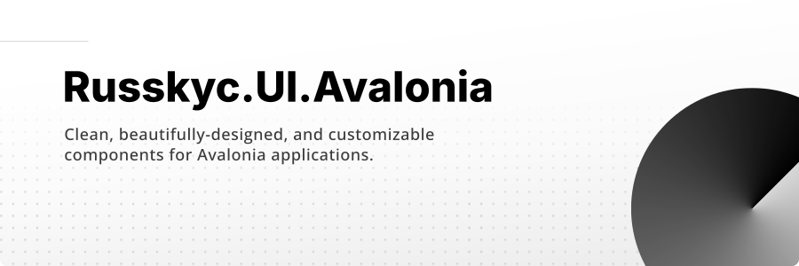

<a href="#">
    
</a>

<h2 align="center">Russkyc.UI.Avalonia - Create Beautiful UI's for Avalonia</h2>
<p align="center">
    
    
    
    
    
</p>
<p style="text-align: justify">
Russkyc.UI.Avalonia provides clean, beautifully-designed, and customizable components inspired by the design of <a href="https://ui.shadcn.com">shadcn/ui</a> for Avalonia applications.
</p>

## Installation (Pre-release)

#### 1. Download
The package can be downloaded installed by the Nuget package manager UI,
Package Reference, Nuget CLI, Package manager, and other Nuget supported
channels.

<div align="center">
    <br/>
    <a href="https://www.nuget.org/packages/Russkyc.UI.Avalonia">
        
    </a>
    <br/>
</div>

PackageReference
```
<PackageReference Include="Russkyc.UI.Avalonia" Version="0.1.0-pre" />
```

Nuget CLI
```
dotnet add package Russkyc.UI.Avalonia --version 0.1.0-pre
```

Package Manager
```
NuGet\Install-Package Russkyc.UI.Avalonia -Version 0.1.0-pre
```

#### 2. Configuration

Update Resources in App.axaml

```xaml
<Application.Resources>
    <ResourceDictionary>
        <ResourceDictionary.MergedDictionaries>
            <!-- Theme (Customizable) -->
            <ResourceInclude Source="avares://Russkyc.UI.Avalonia/Themes/Zinc.axaml" />
            <!-- Base (Required) -->
            <ResourceInclude Source="avares://Russkyc.UI.Avalonia/Base.axaml" />
            <ResourceInclude Source="avares://Russkyc.UI.Avalonia/Controls.axaml" />
        </ResourceDictionary.MergedDictionaries>
    </ResourceDictionary>
</Application.Resources>
```

All theme colors and defaults (including radius, border thickness, and more) can be customized. Please see [Theme and Styling](#theme-and-styling)

## Usage

```xaml
<!-- Button Sampler -->
<StackPanel Orientation="Horizontal" Spacing="7">
    <Button Content="Primary" />
    <Button Content="Destructive" Classes="Destructive" />
    <Button Content="Outline" Classes="Outline" />
    <Button Content="Ghost" Classes="Ghost" />
    <Button Content="Link" Classes="Link" />
    <Button Content="Disabled" IsEnabled="False" />
</StackPanel>
```
Components are built on top of the existing Avalonia controls.
No fancy namespace imports needed, all supported controls are
automatically themed and changed using supported class variants.

## Theme and Styling

The theme can be customized using a resource dictionary with the following template.
All components use the defaults and theme provided in this template.

```xaml
<ResourceDictionary xmlns="https://github.com/avaloniaui"
                    xmlns:x="http://schemas.microsoft.com/winfx/2006/xaml">
    <!--  Defaults  -->
    <CornerRadius x:Key="Radius">5</CornerRadius>
    <Thickness x:Key="BorderThickness">1</Thickness>
    <Thickness x:Key="ActiveBorderThickness">1</Thickness>
    <Thickness x:Key="Padding">12,7</Thickness>
    <x:Double x:Key="ControlMinHeight">36</x:Double>
    <!--  Theme  -->
    <ResourceDictionary.ThemeDictionaries>
        <!--  Light  -->
        <ResourceDictionary x:Key="Light">
            <!--  Colors  -->
            <Color x:Key="Background">#FFFFFF</Color>
            <Color x:Key="Foreground">#000000</Color>
            <Color x:Key="Card">#FFFFFF</Color>
            <Color x:Key="CardForeground">#000000</Color>
            <Color x:Key="Popover">#FFFFFF</Color>
            <Color x:Key="PopoverForeground">#000000</Color>
            <Color x:Key="Primary">#18181b</Color>
            <Color x:Key="PrimaryForeground">#FAFAFA</Color>
            <Color x:Key="Secondary">#f4f4f5</Color>
            <Color x:Key="SecondaryForeground">#18181B</Color>
            <Color x:Key="Muted">#F4F4F5</Color>
            <Color x:Key="MutedForeground">#71717A</Color>
            <Color x:Key="Accent">#F4F4F5</Color>
            <Color x:Key="AccentForeground">#18181B</Color>
            <Color x:Key="Destructive">#EF4444</Color>
            <Color x:Key="DestructiveForeground">#FAFAFA</Color>
            <Color x:Key="Border">#E4E4E7</Color>
            <Color x:Key="Input">#E4E4E7</Color>
            <Color x:Key="LightOverlay">#06FFFFFF</Color>
            <Color x:Key="LightenOverlay">#12FFFFFF</Color>
            <Color x:Key="DarkOverlay">#06000000</Color>
            <Color x:Key="DarkenOverlay">#12000000</Color>
            <Color x:Key="SurfaceOverlay">#06000000</Color>
            <Color x:Key="SurfaceOverlayDeepen">#12000000</Color>
        </ResourceDictionary>
        <!--  Dark  -->
        <ResourceDictionary x:Key="Dark">
            <!--  Colors  -->
            <Color x:Key="Background">#09090B</Color>
            <Color x:Key="Foreground">#FAFAFA</Color>
            <Color x:Key="Card">#09090B</Color>
            <Color x:Key="CardForeground">#FAFAFA</Color>
            <Color x:Key="Popover">#09090B</Color>
            <Color x:Key="PopoverForeground">#FAFAFA</Color>
            <Color x:Key="Primary">#FAFAFA</Color>
            <Color x:Key="PrimaryForeground">#18181B</Color>
            <Color x:Key="Secondary">#27272A</Color>
            <Color x:Key="SecondaryForeground">#FAFAFA</Color>
            <Color x:Key="Muted">#27272A</Color>
            <Color x:Key="MutedForeground">#A1A1AA</Color>
            <Color x:Key="Accent">#27272A</Color>
            <Color x:Key="AccentForeground">#FAFAFA</Color>
            <Color x:Key="Destructive">#7F1D1D</Color>
            <Color x:Key="DestructiveForeground">#FAFAFA</Color>
            <Color x:Key="Border">#27272A</Color>
            <Color x:Key="Input">#27272A</Color>
            <Color x:Key="LightOverlay">#06FFFFFF</Color>
            <Color x:Key="LightenOverlay">#12FFFFFF</Color>
            <Color x:Key="DarkOverlay">#06000000</Color>
            <Color x:Key="DarkenOverlay">#12000000</Color>
            <Color x:Key="SurfaceOverlay">#06FFFFFF</Color>
            <Color x:Key="SurfaceOverlayDeepen">#12FFFFFF</Color>
        </ResourceDictionary>
    </ResourceDictionary.ThemeDictionaries>
</ResourceDictionary>
```

Which will now replace the default theme in `App.axaml`

```xaml
<Application.Resources>
    <ResourceDictionary>
        <ResourceDictionary.MergedDictionaries>
            <!-- Theme (Replace with new theme) -->
            <ResourceInclude Source="avares://Russkyc.UI.Avalonia/Themes/Zinc.axaml" />
            <!-- Base (Required) -->
            <ResourceInclude Source="avares://Russkyc.UI.Avalonia/Base.axaml" />
            <ResourceInclude Source="avares://Russkyc.UI.Avalonia/Controls.axaml" />
        </ResourceDictionary.MergedDictionaries>
    </ResourceDictionary>
</Application.Resources>
```


## License

This project is licensed under the [MIT License](LICENSE.md)

<h2 align="center">Special Thanks</h2>

<div align="center">
    
    
</div>

<p style="text-align: justify">
This project is made possible by Jetbrains and shadcn.
Jetbrains provided free use of <a href="https://www.jetbrains.com/rider">Rider</a>, the IDE used in the development
of this project. Design and styling is inspired by <a href="https://ui.shadcn.com">shadcn/ui</a>
</p>
